---
title: "AIMEE Milestone 7 Report: Weird Mario"
author: Peli Grietzer
date: April 6, 2021
---

# Overview

The purpose of our Weird Mario project is to use ML techniques to study regularities in emergent execution in a setting where the user’s input primitives are far from the natural level of abstraction of the program’s control flow. 

We use the emulated SNES video-game environment as a logistically efficient proxy to the case exploiting complex applications by means of highly constrained user input---constrained, in this case, to a small alphabet of control signals: up, down, right, left, A, B, X, Y, left-pad, right-pad. Working within an emulated video-games environment has two crucial advantages: 

First, there is a strong foundation of existing open source infrastructure for interfacing ML algorithms with an emulated SNES environment, as well as well-developed best-practices regarding the appropriate learning algorithms, network architectures, and hyperparameters for deep reinforcement in arcade environments.

Second, exploitation of emulated SNES games is an active and well-documented area of amature ‘straw hat’ exploitation research. The exploitation terrain of SNES game Super Mario World, in particular, has been extensively albeit non-systematically studied and documented by speed-runners, modders, and recreational hackers. 

When programming a weird machine by ‘playing’ a video game, one generally cannot hope for a stable semantics at the level of input subsequences. (E.g. the semantics of input subsequences is unlikely to be stable under permutation of the order of subsequences). Instead, one might hope to demonstrate that an ML algorithm can learn general (for the given weird machine) strategies for context-dependent action, such that the algorithm implicitly applies equivalent or related abstract program-manipulations using different input-sequences in different circumstances. 

The ideal demonstration of a learnable general (for the given weird machine) strategy would be training an agent to discover very long chains of weird states, since in order to maintain compositionality when acting in a previously unseen weird state the agent must apply previously learned principles to a novel situation. Learning to maintain compositionality requires powerful generalization that applies not only ‘horizontally,’ across weird states encountered in different training runs, but ‘vertically,’ from weird states that are accessible in early training runs that produce only short chains to weird states that appear only in longer chains and therefore do not appear often during early training. 

A weaker demonstration of a learnable general (for the given weird machine) strategy relies on adding stochasticity to the operation of the weird machine, such that the algorithm cannot simply memorize effective sequences. This is the approach traditionally used in reinforcement learning research when the learning environment is deterministic: the added stochasticity ensures that performance improvement as measured by increase of mean reward over the course of training reflects generalization. 

# Infrastructure 

We built our ‘Weird Mario’ experimentation platform on the basis of OpenAI Gym Retro and an open-source pytorch implementation of the PPO algorithm for [PPO algorithm for deep reinforcement learning](https://github.com/ikostrikov/pytorch-a2c-ppo-acktr-gail).

We forked and heavily modified OpenAI Gym Retro by exposing the emulated system’s program counter, thus allowing users to include a record of the content of the program counter in between agent steps in agent’s observations. 

We forked and modified our chosen pytorch PPO implementation by adding an LSTM network that, at step t, reads the program-counter record that accrue between step t-1 and step t. We also added a variety of new controllable parameters pertaining to  environment configuration and network architecture. 

We chose the PPO algorithm after informally experimenting with more basic actor-critic methods (AC2, AC3) and with replay-buffer methods (Rainbow, Rainbow IQN). We also informally experimented with model-based methods based on MuZero, a generalization of the famous AlphaGo algorithm that DeepMind researchers have successfully applied to Atari games, but found the method ineffective when scaled down to fit our smaller compute budget.  PPO emerged as the most reliable, efficient choice during this period of informal experimentation.  

# Experiments

## Basic Setup

For all our experiments, we artificially initialize Super Mario World in a ‘contained’ weird state known to be stable: We set the value of Mario’s ‘power-up state’ counter is to 22, which renders the Mario sprite orange but does not further affect gameplay unless the agent collects an item that further increments Mario’s power-up state counter. If and when this additional incrementation takes place, what’s known to SNES hackers as an ‘open bus’ anomaly takes place: the SNES attempts to read a subroutine from an unmapped address, which initiates a sequence of hardware responses that results in executing the last value read (the last byte of the unmapped address) as an instruction.  

The initial ‘contained’ weird state, known in the Super Mario World hacking community as ‘Creamsicle Mario,’ is normally reachable on level 1 of Super Mario World through a sequence of in-game manipulations known as ‘powerup incrementation.’ Once a player is in Creamsicle Mario state, the state is maintained by default when a player completes a level or enters a level.  Our setup assumes a scenario in which a player has transitioned to Creamsicle Mario on level 1, and is now entering a new level (or reentering level 1) while in Creamsicle Mario state.

In all our experiments, a play-episode ends when the agent ‘loses a life,’ or after 200 consecutive steps without reward. Imposing a step-limit is necessary in order to prevent never-ending ‘stuck’ episodes, and we have found that a reward-independent time limit pushes the agent towards uninteresting strategies that focus on initiation weird-state escalation as quickly as possible rather than on controlling the weird-state trajectory of the weird-state escalation. 

## Design Decisions

Weird Mario PPO can deploy simultaneous training on all Super Mario World levels (a training approach sometimes known as Joint PPO), or deploy training on multiple instances of a single level. In all cases we run 20 emulated SNES instances in parallel, which we found to deliver the best FPS ratio when running our Gym Retro fork on a mid-range modern ML workstation. It’s possible that further optimization of our Gym Retro fork will allow scaling up to 60 instances with benefits to FPS, as per the case when running unmodded Gym Retro on our workstation: unmodded Gym Retro is the product of years of optimization work iterating on OpenAI’s previous arcade emulation platform Universe, and restoring perfect calibration given the addition of a pipiline from the emulated SNES program counter to the RL agent’s observation space is a gradual process that will benefit from further iterations. 

Initial experiments suggested that Joint PPO makes learning exceedingly difficult given the already-high heterogeneity of weird-machine trajectories in each level. We therefore focussed our current efforts on single-level training. Our preferred level for single-level training is level 3, since level 3 is rich with interactive objects that are readily accessible for interactions upon entering the level. 

Weird Mario PPO can deploy training on pixel observations, training  on program-counter observations, or training on both. The record of program-counter events in between agent steps is very large (around 14,000 program-counter events per step on average) and requires inherently slow sequential processing with a recurrent neural network, so we limit the observations at a step t to the first n events since step t-1. We find that on a mid-range modern ML workstation n=5000 is the maximum practical cutoff.  In future work we may replace the recurrent neural network with the newly discovered ‘linearized transformer’ architecture, a new faster, lighter alternative for processing sequential data.

Training in the combined observation space reliably converges to a higher mean performance than training with either observation space alone, although convergence is significantly slower. Across many different formal and informal experiments, the length cutoff for the observation of the per-step program-counter record given to the recurrent neural network appears to have a roughly linear positive effect on all aspects of learning. Since the length cut-off also linearly and drastically increases the time-complexity of both inference and training computations, we prefer a length-cutoff of n=2000 as our default. 

Weird Mario PPO can deploy a model-architecture that makes a (false) Markov independence assumption, or deploy a model-architecture that incorporates the agent’s observation-history into a new representation using an additional recurrent neural network. The computational costs of the recurrent neural network are themselves trivial, but because history-dependent representations are more fine-grained, training converges more slowly. We generally found history-dependence beneficial in larger-scale experiments and detrimental in smaller-scale experiments. This is to be expected, since more fine-grained representations require more training data to become well-calibrated. 

Weird Mario PPO can deploy an environment wrapper such that an agent i/o interaction with the Super Mario World environment occurs every frame, or deploy an environment wrapper such that an agent i/o interaction with the Super Mario World environment occurs every 4th frame. Reinforcement learning on arcade environments traditionally deploys an environment  wrapper that restricts i/o interactions to every 4th frame, repeating an agent’s action for 4 consecutive frames. Even though more fine-grained input is clearly desirable when dealing with weird states, removing this traditional simplification not only quadruples time-complexity, but can have catastrophic consequences when reward is sparse.  The reason is that without action-repetition random exploration tends to ‘average out’ back to Mario’s initial position before any reward is encountered.  

Weird Mario PPO can initialize Mario with an item-box mushroom (that is, artificially induce a standard-play state that allows the agent to ‘airdrop’ a powerup sprite that may be used to escalate Creamsicle Mario into a further weird state) or without an item-box mushroom. A further optional argument that can be used to accelerate learning at the cost of some additional artificiality sets a timer that renews Mario’s item-box mushroom every 200 frames. 

Weird Mario PPO has five basic reward settings to choose from: 

- Weird Mario gives +1 reward every time the game’s Yoshi Coin counter (a memory address intended to keep count of the number of ‘Yoshi Coins’ Mario collects) goes up.
- As per (1.) but rewarding the delta.
- Weird Mario gives +1 reward for every step in which a size n initial segment of the step’s program-counter record features a previously unseen (per episode) instruction. 
- As per (3) but reward the delta.  
- Weird Mario keeps track (within-episode) of the maximum screen-brightness value so far, and rewards the delta of the maximum.  

We found that reward settings in these five general formats reliably induce weird-state escalation in Weird Mario PPO, as (informally speaking) the agent quickly learns that weird-state space allows for trajectories whose total reward is an order of magnitude greater than the most rewarding trajectories in intended-state space. The principle that weird-state space is as a rule more ‘open ended’ that intended-state space also encouraged us to try integrating   OpenAI’s ‘curiosity drive’ intrinsic exploration-reward formula into our reward functions, but our preliminary experiments with the method suggested that the high risk of  weird-state escalation resulting in a loop strongly deters ‘curiosity drive’ agents from weird-state escalation. 

We generally observed that clipping the rewards at +1 per step (setting 1, setting 3) is beneficial for training stability, but gives the reward signal a somewhat unnatural structure. While training is easier in setting 1 and setting 3, settings 2 and 4 are arguably more realistic proxies to exploitation goals. Note that setting 5 defines a reward entirely in terms of standard SNES outputs to the end-user, and may be used as a proxy to pure ‘black box’ exploitation scenarios. 

Weird Mario PPO inherits the tunable hyperparameters of standard deep PPO. For all experiments, we use the hyperparameter settings Open AI researchers found optimal for training a conventional-play deep PPO agent on emulated Sega Genesis. 

## Results

We look at three kinds of results per experiment: a trained model’s mean score, a trained model’s max score, and the percentage of a trained model’s runs scoring above a given high-score threshold.

We additionally look at the mean score of the set of episodes in which weird-state escalation occurred. The purpose of this additional metric is to ensure that increase in overall mean score is not merely due to the agent engaging in initial weird-state escalation more frequently but also due to the quality of the agent’s weird-state escalation trajectories improving. Since achieving weird-state escalation when initialized in the Creamsicle Mario state isn’t in and of itself a challenging exploitation problem, this additional metric is a crucial sanity check on the interpretation of our general  mean-score results. 

We compare our results to baselines from random agents, and to baselines from agents produced by a DeepMind trajectory tree search method known as ‘The Brute.’ The method known as ‘The Brute’ takes no environment inputs at all except total episode reward, and uses a simple explore/exploit tradeoff formula to search the space of agent input sequences for record-breaking input sequences. ‘The Brute’ is known to be competitive with SOTA  deep RL in certain deterministic arcade environments.    

We run all our experiments in a stochastic variant of the Weird Mario PPO environment. In the commonly-used setting where an input step occurs every 4th frame, we follow DeepMind’s stochasticity procedure and add a 25% chance the environment will repeat the action chosen in the previous step for an additional frame before switching to the new action. In the setting where an input step occurs every frame, we instead add a 5% of the environment ignoring a step and repeating the previous action. 

The purpose of the added stochasticity is to ensure that a trained model’s mean score reflects genuine generalization, rather than memorization that relies on the environment’s determinism. While one might expect that this assurance that results are ‘meaningful’ would come at the cost of raw performance, DeepMind researchers observed that the added stochasticity in fact tends to consistently mildly improve performance in deep PPO, as we have reconfirmed in the specific case of Weird Mario PPO. For this reason, although the main purpose of the added stochasticity is to ensure that mean score is a meaningful measure of generalization, we do not turn the added stochasticity off when training/testing Weird Mario PPO models with regard to max score or number of high-scoring runs. 

Note that when comparing Weird Mario PPO max score to baselines from agents generated using ‘The Brute’, we compare the performance of Weird Mario PPO in the stochasticity-added environment both to the performance of ‘The Brute’ in the original deterministic environment and to the performance of ‘The Brute’ in the stochasticity-added environment. 

Mean-score results are consistently strong compared to baselines, and reliably scale with compute. Max score results and high-score count results are less decisive, and may reflect limitations of pure deep reinforcement learning as an approach for discovering very high-scoring individual input sequences in deterministic environments: Weeird Mario PPO max score typically beats max score for similar-length random runs by a small margin, and typically beats max score for for similar-length The Brute runs (without added stochasticity) only when the run-length is relatively short. Weird Mario PPO high-score count beats random runs handily for 'mid right tail' score values, but less decivisly for 'extreme right tail' score values. We generlaly observe that high-score count for 'mid right tail' values consistently goes up with succesful deep RL training and scales with compute investment, but high-score count for 'extreme right tail' score values is unevenly responsive to other indicators of training quality, and actively decays in later stages of trainig even as mean performanc and 'mid right tail' performance continue to improve. 

The principal difficulty appears to be that although in the early stages of Weird Mario PPO training mean score and max score rise together, the agent soon discovers strategies with high expected reward but low reward-variance. Strategies with low reward-variance are especially stable given the working of standard deep RL training algorithms such as PPO, since they keep the gradient of the reward-prediction network (aka the ‘value network’ or ‘critic network’) small. We informally experimented at length with introducing tweaks to PPO’s advantage computations (the formula for the impact of sampled performance on the network’s gradient) with the purpose of inducing a bias in favor of strategies with high reward-variance, but currently do not believe this is a promising direction: deep RL methods are famously fragile, and there may well be no ‘clean’ way to introduce such a bias. 

While these issues can make deep RL an awkward fit for emergent-execution research, which naturally tends to focus on outlier discovery in  deterministic environments, it is unlikely that the modest mean scores we have observed represent the true ceiling for current-generation deep RL agents in the Weird Mario environment. Deep RL in arcade environments is known to undergo ‘phase transitions’ when scaled to a new order of magnitude of compute, and so our experiments are not necessarily informative as to the results one should expect when investing x10 or x100 the compute to run 200 or 2000 parallel emulated SNES environments. We currently have no immediate plans to shift to these scales, which may not be a natural fit for the intended spirit or budgetary structure of AIMEE. 

One source of difficulty for Weird Mario PPO may be the heterogeneity between different implicit ‘stages’ of a successful weird-state escalation episode. In the first implicit stage, the agent traverses the level towards a power-up sprite, and must contend with the ordinary challengers of Super Mario World play (such as avoiding enemy-sprites and pitfalls) in addition to favorably arranging memory-space in anticipation of the escalation. In the second implicit stage, the agent clashes with the power-up sprite, and must optimize factors such as the trajectory, speed, and timing of the clash --  controlling the values of these factors requires mastery of standard Super Mario World play, and the effects of the values of these factors on the subsequent weird-machine escalation are highly non-linear and (in the technical sense) chaotic. In the third implicit stage, after the weird-state escalation, standard Super Mario World play is no longer relevant -- the ‘meaning’ of further agent inputs now depends on the specific context brought about by the initial weird-state escalation, and may even be null in some cases. 

While the qualitative difference between implicit ‘stages’ is itself (plausibly) a source of difficulty, this difficulty is (plausibly) exacerbated by the vulnerability of standard deep RL methods to causal-attribution failures in the case of long dependencies. For instance, we believe Weird Mario PPO is prone to evaluate agent actions in ‘stage three’ based on the events subsequent to these actions even in cases where the weird-state trajectory is unresponsive to agent actions after the initial weird-state escalation. It may be possible to ameliorate this problem in future work by drawing on a new technique from the literature: A recently released new method from DeepMind called ‘Synthetic Returns for Long-Term Credit Assignment’ reportedly makes great strides over standard deep RL methods in environments dominated by long-term causal dependencies, and we intend to explore integrating this new method into future work. 

On the task-design side, it may be worthwhile to spin-off new variants of our Weird Mario PPO environment that restrict the training domain to a single implicit ‘stage.’ One relatively simple possibility along these lines would be to hand-craft an initial weird-state escalation whose weird-states trajectory is known to be responsive to subsequent agent-input, and initialize the environment to the first time-step after the initial weird-state escalation. 

## Upcoming Work 
Reinforcement learning has been slow to show itself in production because of its tendency to overfit to its reward function, ultimately and fundamentally limiting itself to one particular strategy of a rather myopic agent. The tendency for progress in max score to not keep pace with progress in mean score demonstrates an agent that balances 'explore' and 'exploit' enough to learn complex and strategic behavior, but lacks capacity for exploration over the agent-space itself (translated behaviorally as the lack of ability to generalize over strategies even if the strategy discovered is good enough). 

Our aim in upcoming work is to combine genetic and reinforcement learning approaches, extending the SOTA in evolutionary reinforcement learning. This strategy consists of an outer loop enacting a genetic process of mutation and crossover on evolved agents formally defined by genotype and phenotype.These agents represent policies, allowing us to explore far broader initialization strategies than random initialization, allowing even for a designation between inherited and learned behavior (a kind of transfer learning).

The advantage of this approach over pure deep reinforcement learning is that the resulting learning algorithm doesn’t overfit a particular policy: instead the GA searches over a robust abstraction of all possible agent behaviors, allowing for a tunable and high-level explore/exploit problem. A literature review suggests that this approach is optimal for real world conditions where reward is sparse, and more importantly where initially discovered reward-patterns are misleading with regard to overall reward-structure. 

## Screen Captures

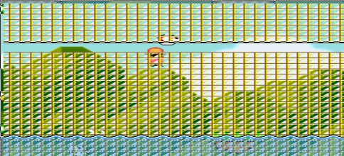

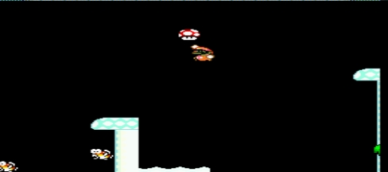

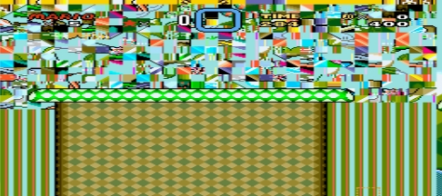

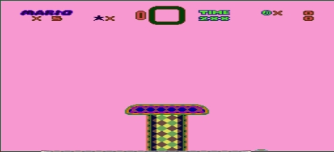

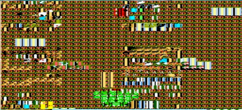

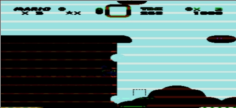

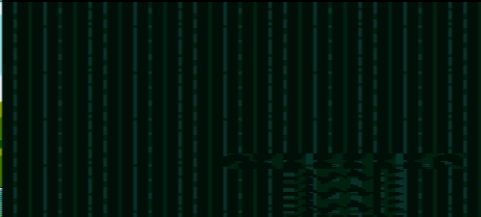

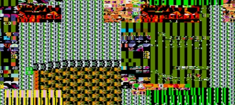

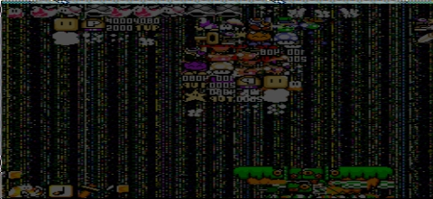

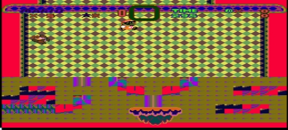

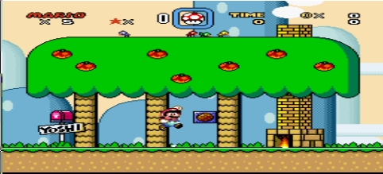

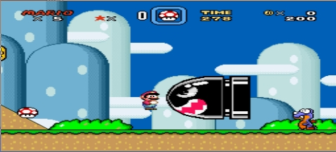

